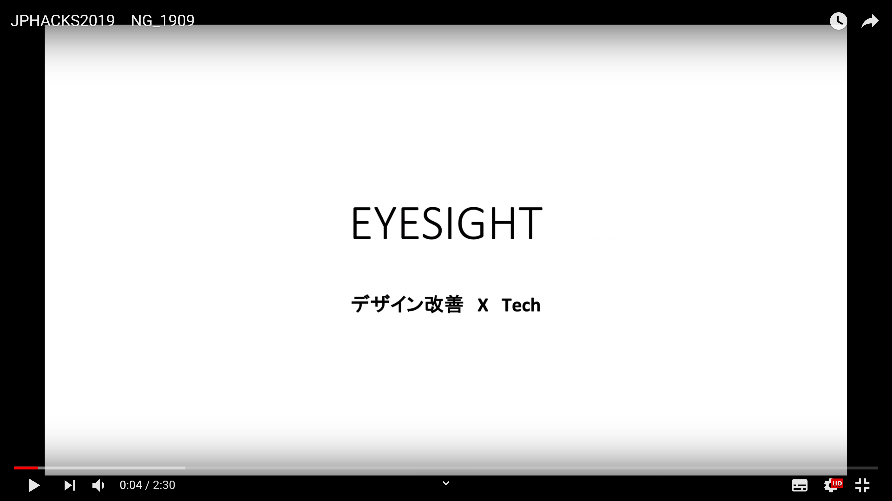

### EyeSight

## 製品概要
### デザイン改善XTech

### 背景（製品開発のきっかけ、課題等）
デザイン改善がもっと合理的に行えないかと感じたことがきっかけ。
また、昨今のビジネス界ではデザインの重要性が説かれているので、デザイン改善は確実に将来大切になると感じた。

### 製品説明（具体的な製品の説明）
WEBカメラから取得された画像を元に、ユーザーの目線データを収集し、それをヒートマップで表示する

### 特長
#### 1. 今まで高額だったアイトラッキングが、技術の進歩により安く多くの人から情報を手に入れられるようになった
たったの３人で４０万円かかっていたアイトラッキングを技術により格安で提供することができるようになった。
さらに、今までのアイトラッキングはユーザーに目線を特殊なカメラをつけてもらう必要があったため、普段の環境でのテストができなかったが、EyeSightではユーザーの普段の環境でできるため、より自然な状況なユーザーの情報を入手することができるようになった。

#### 2. 仮説検証によるデザイン改善に終止符を
今まではリーンスタートアップやアジャイル開発などが流行っていることから分かるように、「仮説検証」によるデザイン改善が流行りであった。
しかし、コンバージョンをしたユーザーはどこを見ていて、そうでないユーザーはどこを見ているのかを情報から判断できるようになるので、より合理的に判断できるようになる。
これにより、仮説検証でちまちまと回していた改善フローが一気にスピードアップし、ビジネスとしてのスピードも大きく上がる

#### 3. 未来的にありうる「デザインの自動生成」に必要なデータを収集できる
EyeSightで集まるデータは端的に言うと「どんなレイアウトでどんな目線が誘発されるのか？」というデータだ。
昨今のAIによる自動化を妨げているのは、「データの蓄積」であることは既知の事実である。
よって「どんなレイアウトでどんな目線が誘発されるか？」というデータが溜まることは「デザインの自動生成」において大きな優位性になることは間違いない。

### 解決出来ること
- アイトラッキングのコモディティ化
- 仮説検証によるデザインの改善スピード
- 将来的にデザインの生成

### 今後の展望
- デザイン研究への活用
- デザイン改善の提案の自動化
- デザインの自動生成

### 補足
* WEBサイトを訪れるユーザーには「WEBサイトを見ているだけでお金が溜まるクロム拡張」として提供する
* ユーザーはWEBサイトを見ているデータが溜まるとポイントになり、それがAmazonギフト券などによって還元される
* そのデータを企業へ売り、利益を得るというビジネスモデルが成り立つ

## 開発内容・開発技術

chrome extension, javascript, 
https://drive.google.com/file/d/1rk8FvU4Amk0XbJ8Yf26nk0-DogJ2pG7G/view?usp=sharing

### 活用した技術
#### API・データ

#### フレームワーク・ライブラリ・モジュール
* 目線の取得
  * ChromeExtension
  * webgazer.js
* 企業さまの管理画面
  * Vue.js
* バックエンド
  * Rails 

#### デバイス
* PC
(将来的には「ブラウジングするだけでお金が溜まるWEBブラウザ」をiPhoneやAndroid向けに開発することでスマホ向けのデザインについてもできるとは考えている)

### 研究内容・事前開発プロダクト（任意）
特になし

### 独自開発技術（Hack Dayで開発したもの）
#### 2日間に開発した独自の機能・技術
* 目線の取得
* 目線データ等を保存するAPI
* 目線のデータをヒートマップで表示
* コンバージョンしたかによるフィルタ機能 
* デザインが変わった時のバージョン管理機能

あとはissueを見ると大体の開発内容が分かるようになっています。
